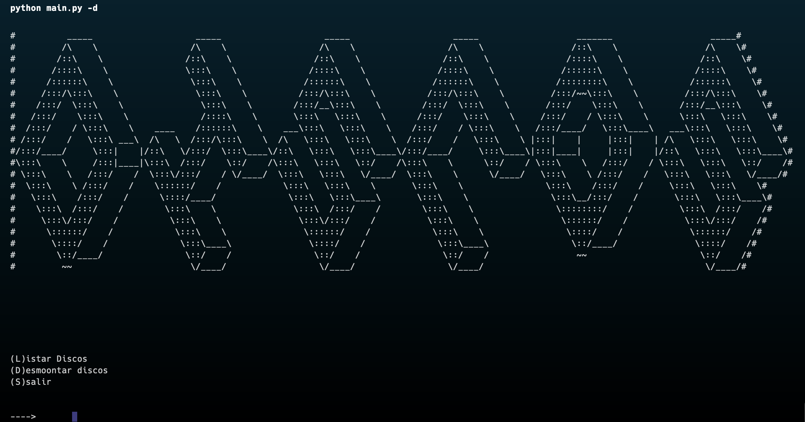

# Gestor de Memoria En Linux (Ubuntu)

## Descripción

Este proyecto permite ver el el uso de la memoria en linux y gestionarla asi como eliminarla y ver la grafica de como cambia el esatdo

## Tecnologías Utilizadas

- **Python**
- **Matplot**

## Instalación

1. Clona el repositorio:
    ```bash
    git clone https://github.com/itsFDavid/Gestor-de-memoria-en-linux.git
    ```
3. Instala alguna herramientas usadas como MatplotLib:
    ```bash
    python -m pip install -U pip
    python -m pip install -U matplotlib 
    ```
4. Inicia el programa para ver el manual:
    ```bash
    python3 main.py
    python main.py
    ```
5. Inicia el programa con argumentos:
    ```bash
    python3 main.py -r
    python main.py  -m
    ```


## Vistas de la app

A continuación se muestran capturas de pantalla de la interfaz de usuario:

### Manual del gestor


### Gestion de la Ram


### Gestion de la VRam


### Gestion de los discos montados


## Contribución

1. Haz un fork del repositorio.
2. Crea una rama para tu característica o corrección de errores (`git checkout -b nombre-rama`).
3. Haz commit de tus cambios (`git commit -am 'Agrega nueva característica'`).
4. Haz push a la rama (`git push origin nombre-rama`).
5. Abre un Pull Request.


## Contacto

- **Nombre**: Francisco david
- **Email**: FDavid04@icloud.com
- **GitHub**: [itsFDavid](https://github.com/itsFDavid)

